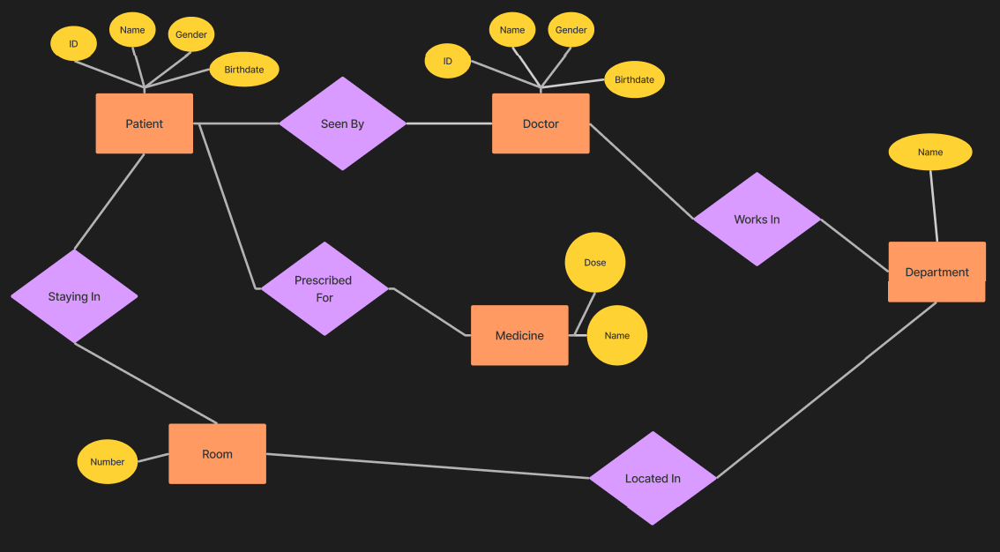

# Patient_Doctor_API

This web api is built using django using sqlite database.

## ER Diagram

## Postman Collection

[Postman Collection](./HospitalAPI.postman_collection.json)

## Postman Preview Video

https://user-images.githubusercontent.com/46086535/191558402-0935769d-b006-4b08-93bb-e5f9dbb96b02.mp4

## API Endpoints

| Endpoint | Method | Description |
| --- | --- | --- |
| /api/patients | GET | Get all patients |
| /api/patients | POST | Create a new patient |
| /api/patients/{id}/ | GET | Get a patient |
| /api/patients/{id}/ | PUT | Update a patient |
| /api/patients/{id}/ | DELETE | Delete a patient |
| /api/doctors | GET | Get all doctors |
| /api/doctors | POST | Create a new doctor |
| /api/doctors/{id}/ | GET | Get a doctor |
| /api/doctors/{id}/ | PUT | Update a doctor |
| /api/doctors/{id}/ | DELETE | Delete a doctor |
| /api/rooms | GET | Get all rooms |
| /api/rooms | POST | Create a new room |
| /api/rooms/{id}/ | GET | Get a room |
| /api/rooms/{id}/ | PUT | Update a room |
| /api/rooms/{id}/ | DELETE | Delete a room |
| /api/medicines/ | GET | Get all medicines |
| /api/medicines/ | POST | Create a new medicine |
| /api/medicines/{id}/ | GET | Get a medicine |
| /api/medicines/{id}/ | PUT | Update a medicine |
| /api/medicines/{id}/ | DELETE | Delete a medicine |
| /api/departments/ | GET | Get all departments |
| /api/departments/ | POST | Create a new department |
| /api/departments/{id}/ | GET | Get a department |
| /api/departments/{id}/ | PUT | Update a department |
| /api/departments/{id}/ | DELETE | Delete a department |

